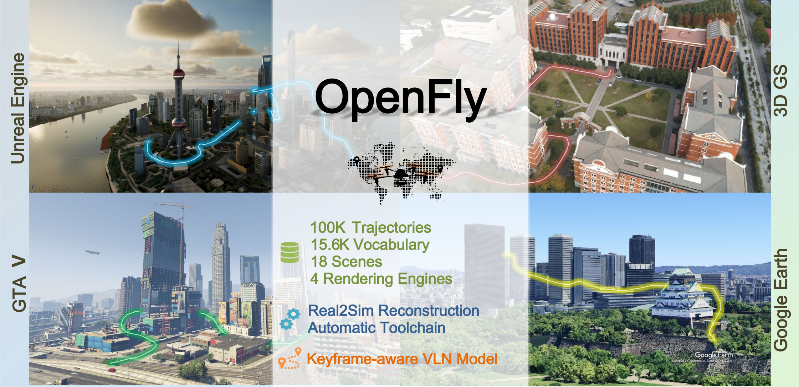

# OpenFly-Platform
[](https://docs.python.org/3/whatsnew/3.10.html)
[](https://docs.ros.org/en/humble/index.html)
[](https://shailab-ipec.github.io/openfly/)
[](https://arxiv.org/abs/2502.18041)

## Introduction
OpenFly is an innovative platform designed to advance research in outdoor aerial Vision-Language Navigation (VLN) by providing a highly automated toolchain for data collection and a large-scale benchmark dataset. It includes 100k diverse flight trajectories, high-quality visual data generated using cutting-edge rendering techniques, and OpenFly-Agent, a keyframe-aware VLN model, all of which will be open-sourced to support the community.



## Table of Contents
1. [Prerequisites](#prerequisites)
2. [Installation](#installation)
3. [Simulation](#Simulation)
4. [Toolchain](#Toolchain)
5. [Training](#Training)
6. [Evaluation](#Evaluation)
7. [Test](#Test)
8. [License](#license)

## Prerequisites
- Operating System: Linux (Ubuntu 22.04 recommended) Windows (For GTAV)
- CUDA
- Python 3.8 or higher (3.10 recommended)
- ROS2(Humble)

## Installation

### Step 1: Clone the Repository
```bash
git clone https://github.com/SHAILAB-IPEC/OpenFly-Platform.git
cd OpenFly-Platform
```

### Step 2: Set Up Python Environment
It is recommended to use a conda environment to manage dependencies.
```bash
conda create -n openfly python=3.10 -y
conda activate openfly
pip install -r requirements.txt
pip install packaging ninja
pip install "flash-attn==2.5.5" --no-build-isolation
git clone https://github.com/kvablack/dlimp
cd dlimp
pip install -e .
```

### Step 3: Install Dependencies
```bash
sudo apt install xvfb # for headless rendering
sudo apt install libgoogle-glog-dev 
sudo apt install ros-humble-pcl-ros
sudo apt install nlohmann-json3-dev
```

### Step 4: Build
```bash
cd tool_ws
colcon build --cmake-args -DPython3_EXECUTABLE=/usr/bin/python3
```

## Simulation

- ​**Simulation Configuration**: 

  All configuration files for simulation scenes are located in: [`/OpenFly-Platform/configs/`](./configs/)  
  Files are ​**named after their corresponding scenario** (e.g., `env_airsim_16.yaml`). ​These YAML files define simulation parameters including IP addresses, ports for scene orchestration, and communication ports for toolchain integration.

1. UE (env_ue_xxx)  
    * Download files from Huggingface [link](https://huggingface.co/datasets/IPEC-COMMUNITY/OpenFly_DataGen/tree/main/ue)  and unzip, or For custom UE scenes, configure them through UnrealCV plugin integration by following the [doc](http://docs.unrealcv.org/en/master/tutorials/getting_started.html)
    * Move env_ue_xxx/ folders to OpenFly-Platform/envs/ue/

2. AirSim (env_airsim_xxx)
    * Download files from Huggingface [link](https://huggingface.co/datasets/IPEC-COMMUNITY/OpenFly_DataGen/tree/main/airsim)  and unzip
    * Move env_airsim_xxx/ folders to OpenFly-Platform/envs/airsim/

3. 3DGS (env_gs_xxx)
    * Prepare SIBR_viewers [Refer to this project](https://github.com/graphdeco-inria/hierarchical-3d-gaussians?tab=readme-ov-file#compiling-the-real-time-viewer)
        ```bash
        # For Ubuntu 22.04, install dependencies:
        sudo apt install -y cmake libglew-dev libassimp-dev libboost-all-dev libgtk-3-dev libopencv-dev libglfw3-dev libavdevice-dev libavcodec-dev libeigen3-dev libxxf86vm-dev libembree-dev

        #​ return to the ./OpenFly-Platform directory​
        cd envs/gs/SIBR_viewers

        cmake . -B build -DCMAKE_BUILD_TYPE=Release -DBUILD_IBR_HIERARCHYVIEWER=ON -DBUILD_IBR_ULR=OFF -DBUILD_IBR_DATASET_TOOLS=OFF -DBUILD_IBR_GAUSSIANVIEWER=OFF 
        cmake --build build -j --target install --config Release
        ```

    * Download files from Huggingface link (Coming soon), or you can generate custom env following [Hierarchial 3DGS](https://github.com/graphdeco-inria/hierarchical-3d-gaussians)
    * Move env_gs_xxx/ folders to OpenFly-Platform/envs/gs/

4. GTAV (env_game_xxx) ( **! You should configure it under Windows** )

    - Installation of DeepGTAV following this [repo](https://github.com/David0tt/DeepGTAV)
    - Set the game in windowed mode
    - In the graphics setting MSAA has to be disabled, otherwise no objects are detected. The correct settings should be loaded by replacing the files in `Documents/Rockstar Games/GTA V/Profiles/`, but keep this in mind if you modify the game settings
    - If you have a 4k screen and want to capture 4k data (very hardware hungry, but runs smooth on an RTX3090): Set the screen resolution to "7680x4320DSR" in NVIDIA GeForce Experience. This increases the buffer sizes for pixel perfect 4k segmentation data.

- ​**Simulation Usage**: 

1. For UE, AirSim and 3DGS, launch the env_bridge, and wait for around 20 seconds until you see 'ready to be connected'.
    ```bash
    #​ return to the ./OpenFly-Platform directory​
    conda activate openfly
    python scripts/sim/env_bridge.py --env env_xx_xxx #such as env_airsim_16b
    # wait for 20s
    ```
    Due to the GPU-intensive nature of rendering in UE projects, we start it in headless mode. If you want to view the UE rendering screen, please comment out the headless-related code in `envs/ue/env_ue_xxx/CitySample.sh`. Note that this may cause the rendering interface to crash.

2. For GTAV(Coming soon，The game update caused a bug.)

## Toolchain

- ​**Toolchain Configuration**: 

  All configuration files for Toolchain are located in: [`/OpenFly-Platform/configs/`](./configs/)  
  Files are ​**named after their corresponding scenario** (e.g., `env_airsim_16.yaml`). ​For each scenario, the simulation and toolchain share the same configuration file. For the toolchain, the configuration file includes the occupancy map information, trajectory generation parameters, etc. The specific meaning of each parameter can be found in the configuration file [`/OpenFly-Platform/configs/env_airsim_16.yaml`](./configs/env_airsim_16.yaml) .

1. Scene data files
    * Download files from Huggingface [link](https://huggingface.co/datasets/IPEC-COMMUNITY/OpenFly_DataGen/tree/main/pcd_map) and unzip,or generate point cloud data by following the toolchain configuration.
    * Move env_xx_xx.pcd files to OpenFly-Platform/scene_data/pcd_map.
    Raw point cloud files (PCD format) for scenes are stored in: [`/OpenFly-Platform/scene_data/pcd_map/`](./scene_data/pcd_map/). 
    Processed segmentation data (e.g., semantic labels, region partitions) is stored in: [`/OpenFly-Platform/scene_data/seg_map/`](./scene_data/seg_map/).


- ​**Toolchain Usage**:  

1. point cloud generation:

    UE:
    * We utilized the dataset provided by [this project](https://github.com/city-super/MatrixCity), using depth maps and pose information, and synthesized point clouds according to [this code](https://github.com/city-super/MatrixCity/blob/main/scripts/rgbd2pc.py).

    AirSim:
    * We traversed the simulated environment through a grid, collected lidar point clouds, and transformed the coordinates to the world coordinate system. Finally, we merged all the point clouds to obtain the point cloud of the entire scene. 
    You can adjust the scanning range *MapBound* and interval *LidarDelta* in the corresponding configs/env_airsim_xx.yaml.
    ```bash
    #​ return to the ./OpenFly-Platform directory​
    conda activate openfly
    bash scripts/toolchain/pcdgen_tool.sh env_xx_xxx #such as env_airsim_16
    ```

    3DGS:
    * We directly utilized the sparse point cloud synthesized by colmap, with the file path at <3dgs_dataset>/camera_calibration/aligned/sparse/0/points3D.ply.

    GTAV(Coming soon)


2. segmentation generation:

    UE, AirSim, and 3DGS:
    * Executing the simulation, run the shell script responsible for generation the segmentation.We provide two selectable modes: ​​BEV generation​​ and ​​manual annotation​​.
    ```bash
    #​ return to the ./OpenFly-Platform directory​
    #BEV generation
    bash scripts/toolchain/seggen_tool.sh env_xx_xxx bev #such as env_airsim_16
    ​#manual annotation​
    bash scripts/toolchain/seggen_tool.sh env_xx_xxx manual #such as env_airsim_16
    ```

    Due to the high GPU requirements for rendering urban scenes in UE, to avoid program crashes, the uploaded binary files are configured to use the lowest rendering settings by default (we found that this does not affect the quality of the generated images). If you wish to render images with higher quality, you can refer to `env_ue_xxx/City_UE52/Saved/Config/Linux/GameUserSettings_best.ini` to modify `GameUserSettings.ini`.
    
    GTAV(Coming soon)


3. trajectory generation: 

    UE, AirSim, and 3DGS:
    * Executing the simulation, run the shell script responsible for generating the trajectory.
    ```bash
    #​ return to the ./OpenFly-Platform directory​
    bash scripts/toolchain/trajgen_tool.sh env_xx_xxx #such as env_airsim_16
    ```

    GTAV(Coming soon)

4. instruction generation: 

    Our OpenFly dataset has been converted to parquet format. If you want to use this code, you need to convert parquet back to uncompressed format. So we recommend that you use this code to generate your own trajectory instructions.
    You need to prepare: 1. OpenAI's API  2. Traj in the same format as the OpenFly dataset (a series of images and a jsonl file that records actions)
    * When using GPT to generate instructions, first configure the "key" and "model" in the [`/OpenFly-Platform/tool_ws/src/ins_gen/gpt_api_config.json`](./tool_ws/src/ins_gen/gpt_api_config.json) file, modify the data directory in [`/OpenFly-Platform/tool_ws/src/ins_gen/gpt_generation.py`](./tool_ws/src/ins_gen/gpt_generation.py). And use a json file to store all the traj directories you want to generate instructions
     Then run the shell script responsible for generating the instructions.
    ```bash
    #​ return to the ./OpenFly-Platform directory​
    conda activate openfly
    python3 tool_ws/src/ins_gen/gpt_generation.py --json Your json PATH --type train/test #
    ```
    

## Training:

<!-- #### Clone this repository and navigate to train folder

```bash
git clone https://github.com/XXXXX.git
```

Install Packages

```Shell
conda create -n openfly python=3.10 -y
conda activate openfly
pip install --upgrade pip 
pip install -r requirements.txt

pip install packaging ninja
pip install "flash-attn==2.5.5" --no-build-isolation
``` -->

#### Data Preparation

We provide an example data [here](https://huggingface.co/datasets/IPEC-COMMUNITY/OpenFly). You can download it and run the whole pipeline quickly.

For your custom datasets, make sure that you pre-build all the required [TensorFlow Datasets](https://www.tensorflow.org/datasets) (TFDS) datasets.

1. Firstly, prepare the train.json with following format:

   ~~~json
   [
       {
           'image_path': '', 
           'gpt_instruction': 'Proceed towards a medium ...', 
           'action': [9, ...], 
           'index_list': ['image_2', ...], 
           'pos': [[-93.81, 536.11, 74.86], ... ], 
           'yaw': [1.57, 1.57, 1.57, 1.57]
        }, 
       ...
   ]
   ~~~

2. Now you can run [`train/datasets_builder/vln/vln_dataset_builder.py`](./train/dataset_builder/vln/vln_dataset_builder.py) which is used to transfer the generated data format to rlds format.

3. ~~~
   cd train/datasets/vln
   tfds build --data_dir <TFDS_DATA_DIR>
   ~~~

4. For custom dataset, you need to change the data mixture after transferring the data format in [`train/datasets/dataset.py`](./train/datasets/dataset.py) to specify the names of datasets.

```python
        OXE_NAMED_MIXTURES: Dict[str, List[Tuple[str, float]]] = {
            "vln_mix" : [                                  
                ("vln_scene1", 1.0),                            
                ("vln_scene2", 1.0),
            ],
        }
```

#### Download Pretrained Weights

We released our pretrained weights of Openfly-Agent which is trained by full fine-tuning [OpenVLA model checkpoint](https://huggingface.co/openvla/openvla-7b-prismatic). Now you can download the weights and directly finetuning your data.

| Model         | Link                                                    |
| ------------- | ------------------------------------------------------- |
| Openfly-Agent | [huggingface](https://huggingface.co/IPEC-COMMUNITY/openfly-agent-7b) |

#### Train

The training script are [`train/train.sh`](./train/train.sh). And you need to change following parameters:

1. **grid_size** :refers to the token compress ratio.
2. **history_frames** :refers to the number of frame as history information, which should be corresponded to your custom dataset setting.
3. **model_name_or_path** :path to the pretrained VLM weights

Other hyperparameters like "batch_size", "save_steps" could be customized according to your computation resources.

## Evaluation 

You can refer to our evaluation script `train/eval.py` to evaluate your openfly-agent.

We use the `eval_test.json` file as a demonstration to configure the environments that need to be evaluated. You can customize an evaluation configuration file based on the json files available at https://huggingface.co/datasets/IPEC-COMMUNITY/OpenFly/tree/main/Annotation

## Test

Make sure your trained checkpoint dir has two files: "data_statistics.json". If not, please copy them from downloaded openfly-agent weights or this [link](https://huggingface.co/IPEC-COMMUNITY/spatialvla-4b-224-sft-fractal).

```python

from typing import Dict, List, Optional, Union
from pathlib import Path
import numpy as np
import torch
from PIL import Image
from transformers import LlamaTokenizerFast
from transformers import AutoConfig, AutoImageProcessor, AutoModelForVision2Seq, AutoProcessor
import os, json
from model.prismatic import PrismaticVLM
from model.overwatch import initialize_overwatch
from model.action_tokenizer import ActionTokenizer
from model.vision_backbone import DinoSigLIPViTBackbone, DinoSigLIPImageTransform
from model.llm_backbone import LLaMa2LLMBackbone
from extern.hf.configuration_prismatic import OpenFlyConfig
from extern.hf.modeling_prismatic import OpenVLAForActionPrediction
from extern.hf.processing_prismatic import PrismaticImageProcessor, PrismaticProcessor


AutoConfig.register("openvla", OpenFlyConfig)
AutoImageProcessor.register(OpenFlyConfig, PrismaticImageProcessor)
AutoProcessor.register(OpenFlyConfig, PrismaticProcessor)
AutoModelForVision2Seq.register(OpenFlyConfig, OpenVLAForActionPrediction)


model_name_or_path="IPEC-COMMUNITY/openfly-agent-7b"
processor = AutoProcessor.from_pretrained(model_name_or_path)
model = AutoModelForVision2Seq.from_pretrained(
    model_name_or_path, 
    attn_implementation="flash_attention_2",  # [Optional] Requires `flash_attn`
    torch_dtype=torch.bfloat16, 
    low_cpu_mem_usage=True, 
    trust_remote_code=True,
).to("cuda:0")

image = Image.fromarray(cv2.imread("example.png"))
prompt = "Take off, go straight pass the river"
inputs = processor(prompt, [image, image, image]).to("cuda:0", dtype=torch.bfloat16)
action = model.predict_action(**inputs, unnorm_key="vln_norm", do_sample=False)
print(action)
```

## License

